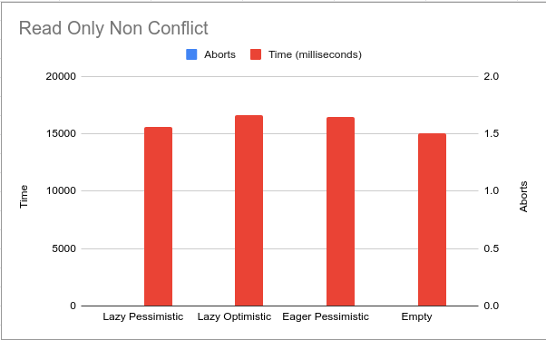
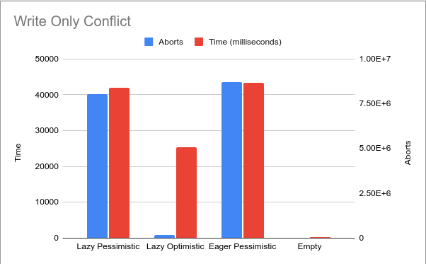

# Transactional Memory Simulator Project Report

#### Joseph Koshakow (jkoshako@andrew.cmu.edu)

## Summary

I implemented a transactional memory simulator that can execute multiple asynchronous transactions. I tested the
performance of various versioning and conflict detection strategies.

The code can found here: https://github.com/jkosh44/transactional-memory-simulator/

## Background

An increasingly popular tool in parallel programming is Transactional Memory. Not only does it allow you to read and
write to and from locations in memory, it also allows you to perform transactions with multiple memory operations.
Transactional memory abstracts away transactional logic from the application logic and into the memory, allowing
programmers to focus on program logic and not memory consistency. Additionally, the underlying transactional
implementation can optimize the memory operations for specific hardware.

In 15-213 we implemented our own version of `malloc` which allowed users to dynamically allocate and deallocate memory
on the heap. I have used this as inspiration to create my own transaction memory in software. I implemented both eager
and lazy versioning and compared the performance under various workloads, and implemented both optimistic and
pessimistic conflict detection and compared the performance under various workloads.

The simulator can handle multiple concurrent transactions all running in parallel. Each transaction is run on it's own
thread.

The simulator exposes the following to APIs to be used by the client.

### Transaction Manager

The following API is used to start new transactions

```C++
/**
 * Begin memory transaction
 * @return transaction
 */
Transaction XBegin();
```

### Transaction

All transactional operations are done with the `Transaction` object itself. Below is the API

```C++
/**
 * Store value at address for transaction
 *
 * @tparam T type of value
 * @param address location to Store value
 * @param value value to Store
 *
 * @throws TransactionAbortException
 */
template<typename T>
void Store(T *address, T value);

/**
 * Loads value from address for transaction
 *
 * @tparam T type of value
 * @param address location that value is stored
 *
 * @return value stored at address
 *
 * @throws TransactionAbortException
 */
template<typename T>
T Load(T *address);

/**
* Commit memory transaction
*
* @param transaction_id id of transaction to commit
*
* @throws TransactionAbortException
*/
void XEnd();
```

Each of these operations can abort and throw a `TransactionAbortException` and it's up to the client to retry the
transaction. I've also provided the following utility function that will retry a transaction until it is successful

```C++
/**
 * Run a transaction until the transaction is successful
 *
 * @param transaction_manager transaction manager
 * @param func function to run with transaction
 * @return number of aborts
 */
int RunTransaction(TransactionManager *transaction_manager, const std::function<void(Transaction *)> &func);
```

## Approach

The entire project was implemented in C++ 17 and no external libraries were used. The implementation consists three main
data structures: `VersionManager`, `Transaction`, `TransactionManager`

### Version Manager

The version manager is responsible for maintaining different versions of the values found at various addresses. This is
required so that transactions can be atomic. When a transaction aborts we are able to handle it and restore all the
pre-transaction values to the addresses that the transaction changed. Originally this was implemented with one big
global map. The keys were transaction ids, and the values were another map that mapped addresses to values. This became
inefficient and unnecessarily complicated because it served as a single point of contention and required complex
synchronization. I realized it would be much better if each transaction maintained it's own map of addresses to values.
That way there would be no contention between transaction when dealing with address versions. I implemented two
different types of version managers, eager and lazy.

#### Eager Version Manager

##### Store

Every time a transaction tries to store a value, the eager version manager checks if it's the first time that
transaction has written to that address. If so, the version manager saves the current value at that address to it's undo
log. Then it writes the new value to memory. We only care about the earliest write to each address because that is the
value that we will use to undo.

##### Load

Whenever a transaction tries to load a value, the eager version manager just loads it directly from memory.

##### Commit

When a transaction tries to commit, the eager version manager just needs to throw away the undo log.

##### Abort

When a transaction aborts, then the eager version manager must get the the entire contents of the undo log and write the
values to the specified addresses. That way, the transaction undoes all of it's changes.

#### Lazy Version Manager

##### Store

Every time a transaction tries to store a value, the lazy version manager saves that value and address to a write
buffer. The write buffer only needs to maintain the most recent write to every address for a single transaction, because
that is what will ultimately get written to memory.

##### Load

Whenever a transaction tries to load a value, the lazy version manager first checks if the value is in the write buffer.
If the address is in the write buffer then the transaction reads from the write buffer. Otherwise the transaction reads
directly from memory.

##### Commit

When a transaction tries to commit, the lazy version manager needs to go through every write in the write buffer and
apply the changes in memory.

##### Abort

When a transaction aborts, then the lazy version manager just throws away the write buffer.

### Transaction Manager

The transaction manager serves as both a coordination/orchestration layer as well as a contention manager. The first
functionality exposed by the transaction manager is the ability to start a new transaction. The transaction manager
creates a new transaction object and assigns it a monotonically increasing integer identifier. The second functionality
is to detect and handle conflicts between transactions. To accomplish this, the transaction manager maintains two global
data structures. A map of addresses and transactions that have read that address and a map of addresses and transaction
that have written to that address. Each of these two data structures are protected by a `std::shared_mutex`. When a
transaction commits or aborts, then you need to remove it from both data structures. This was by far the most difficult
part of the project, correctly synchronizing access to these data structures was extremely difficult. The transaction
manager has two different types of conflict detection, pessimistic and optimistic conflict detection.

#### Pessimistic Conflict Detection

All conflicts are detected and handled at each load and store.

##### Store

If any other transaction has read or written to this address then we abort the current transaction. This is a "writer
loses" approach to handling conflicts. Originally I tried to implement a "writer wins" approach where all other
transactions that have written or read from an address are aborted and the current transaction continues, but it had the
following issues:

1. Having one transaction abort another transaction is much more difficult and error prone to implement than having a
   transaction abort itself.
2. "Writer wins" can lead to live locks where two transactions keep aborting each other as they try and write to the
   same address, "writer loses" avoids this live lock scenario.

##### Load

If any other transaction has written to this address, then we do one of two things:

1. If the other transaction IS NOT stalled, then we stall until the other transaction completes
2. If the other transaction IS stalled, then we abort the other transaction.

Scenario 2 is to avoid deadlocks. Imagine the following scenario:

1. T0 writes to address A
2. T1 writes to address B
3. T0 tries to read B and stalls waiting for T1 to commit
4. T1 tries to read A and stalls waiting for T0 to commit

We now have two transactions stalled waiting for each other to commit. At first I didn't anticipate this second scenario
and kept running into deadlocks. After finding lectures notes for this class from a previous semester that mentions this
exact issue I was able to add in the second scenario and avoid deadlocks.

#### Optimistic Conflict Detection

All conflicts are detected and handled at commit.

##### Commit

When a transaction commits, it aborts all currently running transactions that have read or written to any address that
the current transaction has written to. This guarantees forward progress because when a transaction gets to the commit
phase it will commit. There's a small exception where two conflicting transactions try and commit at the same time. In
that case only one transaction will commit.

### Transaction

The transaction object maintains the internal state of a single transaction as well as exposes transactional
functionality to clients.

#### State

Each transaction maintains whether the transaction is currently running, committing, aborting, or stalled. Additionally
each transaction maintains a set of all addresses that it has written to and read from. This is to help with conflict
detection. Finally every transaction maintains either an undo log or write buffer depending on the version strategy.

#### Transactional Functionality

The transaction object allows clients to store values at an address, load values from an address, and commit
transactions.

##### Store

First we use the transaction manager to detect and handle any conflicts under pessimistic conflict detection. After the
transaction manager handles any conflicts, it will add the transaction to the global write set for that address. Then
the transaction adds the address to it's local write set. After that we use the version manager's store functionality,
which either updates the address or stores the write in a write buffer.

##### Load

First we use the transaction manager to detect and handle any conflicts under pessimistic conflict detection. After the
transaction manager handles any conflicts, it will add the transaction to the global read set for that address. The the
transaction adds the address to it's local read set. Then we check if the address if in our local write buffer, if so we
return that. If not, we return the value found at the address.

##### Commit (XEnd)

First we use the transaction manager to detect and handle any conflicts at commit time under optimistic conflict
detection. Then we use our version manager to commit our changes. Then we remove our transactions from the global read
and write sets.

## Results

I created sample benchmarks to test performance for different scenarios. I used a hash map to simulate banking
transactions. The map had string keys and double values, where the keys were customers and the values were their account
balance. For each benchmark you can specify the number of concurrent transactions and how many times the benchmark would
be repeated. The benchmarks were further divided into two separate types, conflicting and non-conflicting. For
conflicting benchmarks, each transaction read/wrote from/to every account in the hash map. For non-conflicting
benchmarks each transactions read/wrote from/to two separate accounts and no transactions used the same accounts as each
other. I further divided the benchmarks into read only, write only, and read-write.

For each benchmark I tested the following configurations:

1. Eager data versioning and pessimistic conflict detection
2. Lazy data versioning and optimistic conflict detection
3. Lazy data versioning and pessimistic conflict detection

Eager data versioning and optimistic conflict detection was left out. If a conflict is detected during commit then
somehow we'll need to identify which transaction wrote to the conflicting areas first. That way we know which value to
undo to. To do this, it's not enough to know the timestamp of the transaction, we would need to know the timestamp of
every write in the transaction. While this is possible, the overhead involved is not worth it.

### Machine Specifications

**OS**: Ubuntu 20.04.2\
**CPU**: Intel® Core™ i7-10510U CPU @ 1.80GHz × 8\
**Memory**: 24GiB

### Compiler Details

**version**: g++ version 9.3.0\
**flags**: -pthread, -std=gnu++17

### Non Conflict

For every non-conflicting workload, the performance is roughly the same between all configurations. There is some slight
difference, and some configurations are slightly better than others, but this can be attributed to noise. After running
all the non-conflicting workloads many times they would slightly shift around with the faster configuration changing.

I've included "Read Conflict" under the the "Non Conflict" section because there really is no such thing as a read-read
conflict. No conflict detection strategy even checks for read-read conflicts, so the "Read Conflict" workload is
essentially exactly the same as the "Read No Conflict" workload. I only included it for consistency purposes.

For the read only transactions it makes sense that there is no difference between lazy and eager data versioning,
because there is no data versioning required for read operations. For transactions with writes, there is an equal amount
of work between an undo log and a write buffer. Every write must be inserted into the write buffer/undo log and then
into memory (None of the transactions are writing to the same location more than once). It is possible that lazy
versioning has better locality, since all writes to memory are saved until the end of the transaction, but it doesn't
seem to have a large effect.

When there are no conflicts, pessimistic conflict detection does slightly more work. For every read it checks if there's
a conflict with an existing write. For every write it checks if there's a conflict with an existing read or write.
Optimistic conflict detection checks for every write if there's a conflict with an existing read or write. There is also
a chance for better locality with optimistic conflict detection since every check is done at once during commit time
while pessimistic checks everytime an operation is done. However neither of these two facts are enough to cause
optimistic conflict detection to perform significantly better than pessimistic detection.

#### Read Only Non Conflict

Concurrent Transactions: 10000\
Iterations: 100



#### Read Only Conflict

Concurrent Transactions: 1000\
Iterations: 10


#### Write Only Non Conflict

Concurrent Transactions: 20\
Iterations: 10000


#### Read Write Non Conflict

Concurrent Transactions: 20\
Iterations: 100000


### Conflict

#### Write Only Conflict

Concurrent Transactions: 20\
Iterations: 1000



Between lazy pessimistic and eager pessimistic, they have the same number of aborts. This is expected since they use the
exact same conflict detection strategy. What isn't expected is that they take roughly the same amount of time as well.
Theoretically eager version managers should be much slower, because they have to undo every write when it aborts.
However we are not seeing this. This seems to suggest that running a transaction is much more expensive than aborting
one, to the point that the costs of aborting are completely drowned out by the costs of running the transaction.
Aborting a transaction requires only a single acquisition of locks and then optionally a series of writes to memory.
Running a transaction requires acquiring many locks to update global write/read sets. These lock acquisitions completely
dwarf the time taken to undo the writes in memory.

Optimistic conflict detection has much less aborts. This is expected because conflicts are detected less often compared
to pessimistic conflict detection. Additionally forward progress is more likely in optimistic conflict detection, when
one transaction aborts that means that another transaction is guaranteed to commit. This isn't the case in pessimistic
conflict detection, when one transaction aborts it just means that there was a conflicting write. You could much more
easily end up in a livelock situation where conflicting transactions keep aborting. Though I specifically chose a write
loses implementation for pessimistic conflict detection. That way one transaction keeps aborting itself and the other
transaction can make progress. With writer wins, two transactions could keep aborting each other and you would never
make forward progress.

With much less aborts, you have much less repeated work and much less synchronization, that's why lazy optimistic is so
much faster than the pessimistic schemes.

#### Read Write Conflict

Concurrent Transactions: 20\
Iterations: 1000


With the read write conflict workload we see a similar pattern in aborts compared to the write conflict workload. Both
pessimistic configurations have a similar amount of aborts and the optimistic configuration has much less aborts. The
big difference is that the optimistic configuration takes much longer than the pessimistic configurations. If you
compare the Lazy Optimistic configuration in the write only workload and read write workload, you'll see that the read
write workload takes a little more than twice as long. This make sense because it's doing about twice as much work, for
every write there is a read.

Comparing the two pessimistic configurations for the write conflict workload and the read write workload we see that the
read write workload has an order of magnitude less aborts and takes an order of magnitude less time, which is a bit
counter intuitive since it's doing more work. However we need to recognize that every write is preceded by a read to the
same address. For pessimistic conflict detection, conflicts on reads cause the transaction to stall and wait for the
other transaction to commit. Then when we perform the following write, there's no longer a conflict. Since we
essentially replace a bunch of aborts with stalls, we end up aborting much less and waiting more. Since we are aborting
less, we are doing less repeat work and less synchronization which leads to less overall time. This tells us that
stalling is actually cheaper than restarting the entire transaction. Of course if we have a bunch of long running
transactions then stalling could potentially slow down the system as many other transactions wait for it to finish.

For the read write conflict, even though the lazy optimistic configuration has less aborts than the pessimistic
configurations, it still takes longer. That's because conflicts are detected much later so more work needs to be redone
for every abort.

### Conclusion

For every workload the difference between eager and lazy versioning is negligible. The big difference comes from
optimistic vs pessimistic conflict detection. The biggest factor into how long a workload would take is the number of
aborts in that workload. It's important to remember that this is a very high level implementation of transactional
memory that is completely in software. The cost of synchronization in software is order of magnitudes more expensive
than the cost of writing to memory in software. This might not be the case for transactional memory implemented in
hardware. So unfortunately these results can't likely be expanded to give any intuition to the performance
characteristics of transactional memory implemented in hardware.

The big takeaway from this is that the configuration that reduces the total need for communication will perform the
best. That means that you want to minimize aborts, because everytime you abort a transaction you need to redo all of the
synchronization previously done for that transaction. Even stalling your transaction can be more efficient than starting
it over.

There isn't much importance for locality in this project. The actual loads and stores are determined by the client so we
have no control over the locality there. We do have locality with regards to accessing the version maps and the
read/write sets. However as shown by the results, locality with these data structures don't make a big difference
compared to synchronization/communication.

I tried to use bcc and flamegraph to generate flamegraphs of the various workloads so I could determine exactly where
time was spent for each workload. Unfortunately so much time is spent setting up and running the benchmarks compared to
the actual code, that the transactional methods don't even show up in the flamegraphs. I've included one below from a
write only workload for reference. The SVG can be found
here: [https://github.com/jkosh44/transactional-memory-simulator/tree/main/docs/imgs/wo-c-lo.svg](https://github.com/jkosh44/transactional-memory-simulator/tree/main/docs/imgs/wo-c-lo.svg)
, which allows you to zoom into certain areas of the stack trace as long as you have a good SVG viewer (Google Chrome
can act as an SVG viewer).


## References

- Transactional Memory Lecture Slides: https://www.cs.cmu.edu/~418/lectures/19_transactionalmem.pdf
- Transactional Memory Lecture Notes 2013:  http://15418.courses.cs.cmu.edu/spring2013/article/40 